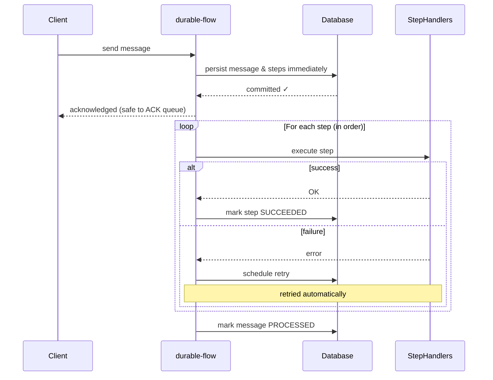

# durable-flow

> ⚠️ **ALPHA VERSION** — This project is in early alpha and requires thorough testing before use in production environments.

[](https://openjdk.org/projects/jdk/21/)
[](https://maven.apache.org/)
[](LICENSE)

**durable-flow** is a lightweight, database-backed workflow engine for Java. When a message arrives, it is instantly persisted — before any processing begins. The workflow then starts immediately: steps execute in order, failures trigger automatic retries, and nothing is lost even if the application crashes.

**Supported databases:** PostgreSQL · Oracle · MySQL / MariaDB · IBM DB2 · Microsoft SQL Server

---

## How It Works

A message arrives and is **persisted to the database immediately** — before any step runs. The workflow starts right away, in the same operation. There is no outbox table, no polling job, and no separate dispatcher process reading a queue later. Persist and execute happen together, in one flow.



No message is ever lost. No step runs twice. Failures are retried automatically.

---

## Quick Start

### Add Dependency

```xml
<dependency>
    <groupId>io.github.rrobetti</groupId>
    <artifactId>durable-flow-core</artifactId>
    <version>1.0.0-ALPHA</version>
</dependency>
```

### Define and Run a Workflow

```java
// 1. Start the engine
DurableFlowEngine engine = new DurableFlowEngine(dataSource, DurableFlowConfig.defaults());
engine.start();

// 2. Define a workflow — steps run in order, with automatic retries on failure
WorkflowDefinition workflow = WorkflowDefinition.builder("order-processing")
    .step("validate", ctx -> StepResult.empty())
    .step("enrich",   ctx -> StepResult.empty()).dependsOn("validate")
        .retryPolicy(RetryPolicy.exponentialBackoff(3, Duration.ofSeconds(1), 2.0, Duration.ofSeconds(30), true))
    .step("notify",   ctx -> StepResult.empty()).dependsOn("enrich")
    .build();

// 3. Receive a message — persisted immediately, workflow starts right away
InboundMessage message = new InboundMessage("order-service", payloadBytes, headers);
ReceiveResult result = engine.receive(message, ReceiveOptions.of(workflow));
// The message is already in the database — safe to ACK the queue message now
System.out.println("Received: " + result.messageId());
```

That's it. The message is saved, steps execute in order, and any failure triggers automatic retries — all without extra infrastructure.

---

## How It Differs from Temporal

Temporal is a full distributed workflow platform that requires its own server infrastructure and uses a deterministic workflow execution model with code replay. It is designed for large-scale, long-running workflows with rich tooling and orchestration features. durable-flow, in contrast, is a lightweight database-backed saga orchestrator that runs directly inside a Java application using only a relational database for coordination. It focuses on simple, durable multi-step workflows without external infrastructure or specialized programming constraints.

---

## How It Differs from the Outbox Pattern

In a traditional transactional outbox pattern, the application writes events to an outbox table and a **separate scheduled job** later reads that table and dispatches the work. There is a deliberate delay between persistence and execution.

durable-flow works differently: the message is persisted **and** the workflow execution begins in the same logical operation. There is no polling loop, no outbox dispatcher, and no lag between saving and processing. The moment `receive()` returns, the message is durable **and** the steps are already running.

You can also pass your own JDBC connection to `receive()` so that the message insertion and your own business writes share a single database transaction:

```java
// Spring example — message insertion and business save are in the same transaction
@Transactional
public String placeOrder(Order order) {
    orderRepository.save(order);
    Connection conn = DataSourceUtils.getConnection(dataSource);
    ReceiveResult result = engine.receive(
        new InboundMessage("order-service", serialize(order), Map.of()),
        ReceiveOptions.of(orderWorkflow, conn));
    // Spring commits conn — both the order save and the message insert are atomic
    return result.messageId();
}
```

See the [Spring Boot Integration guide](docs/spring-boot-integration.md#atomic-receive-with-an-external-connection-preferred) for full details.

---

## Learn More

| Topic | Description |
|---|---|
| [Core Concepts](docs/core-concepts.md) | InboundMessage, WorkflowDefinition, steps, lifecycle hooks, retry policies, execution modes, deduplication, external connection |
| [Configuration Reference](docs/configuration.md) | All config options, persistence, lease management, background recovery, multi-database support, module structure |
| [Spring Boot Integration](docs/spring-boot-integration.md) | Using durable-flow inside a Spring Boot application, including shared-transaction patterns |
| [Table Partitioning](docs/table-partitioning.md) | High-volume schema partitioning strategies |
| [Examples](durable-flow-example/) | Runnable examples (sequential, parallel, no-payload) |

---

## Running the Tests

```bash
# Unit tests (no database required)
mvn test

# Integration tests (requires Docker for Testcontainers)
mvn verify
```
