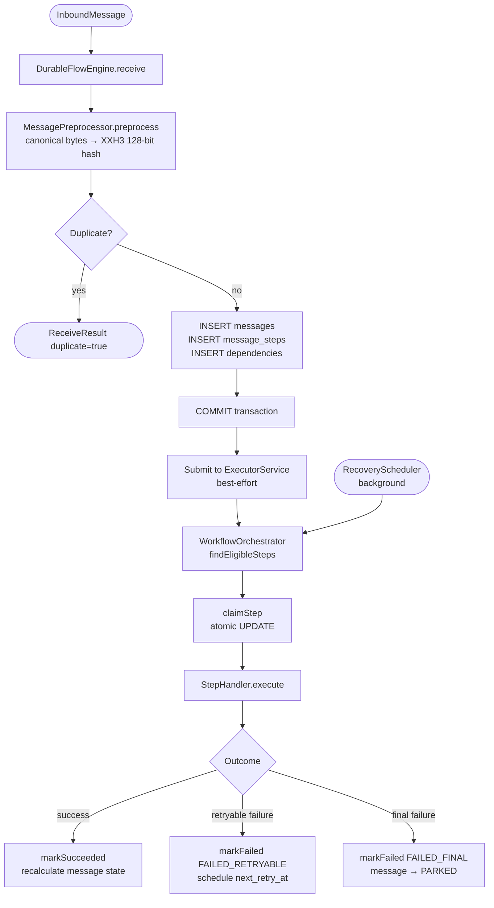
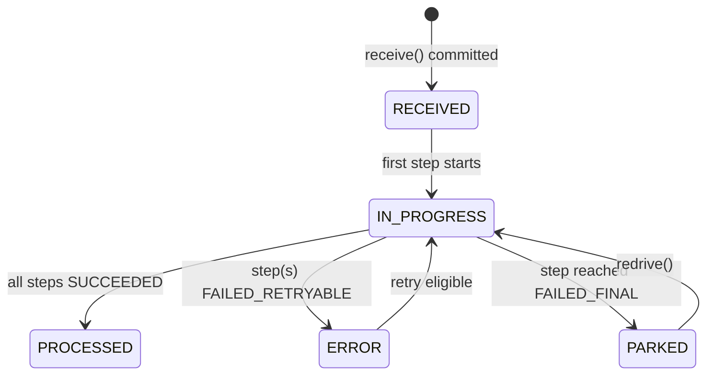
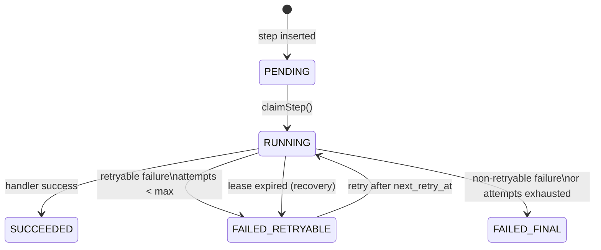
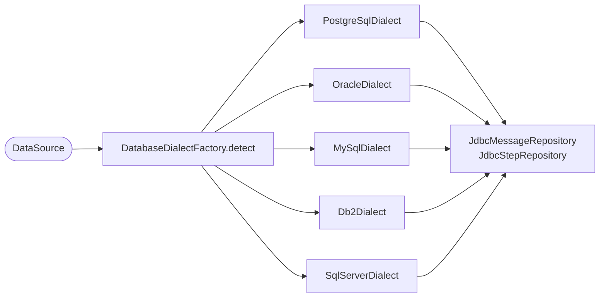

# durable-flow

[](https://openjdk.org/projects/jdk/17/)
[](https://maven.apache.org/)
[](LICENSE)

A production-quality, durable workflow engine for Java. `durable-flow` provides exactly-once,
persistent step execution with DAG dependencies, lease-based concurrency control, automatic retries,
and background recovery — all backed by a relational database.

**Supported databases:** PostgreSQL · Oracle · MySQL / MariaDB · IBM DB2 · Microsoft SQL Server

---

## Table of Contents

1. [Features](#features)
2. [Architecture Overview](#architecture-overview)
3. [Getting Started](#getting-started)
4. [Core Concepts](#core-concepts)
   - [InboundMessage](#inboundmessage)
   - [WorkflowDefinition](#workflowdefinition)
   - [Lifecycle Hooks](#lifecycle-hooks)
   - [ExecutionMode](#executionmode)
   - [RetryPolicy](#retrypolicy)
   - [MessagePreprocessor SPI](#messagepreprocessor-spi)
   - [MetricsListener SPI](#metricslistener-spi)
5. [Deduplication](#deduplication)
6. [Persistence & Schema](#persistence--schema)
7. [Lease-Based Step Claiming](#lease-based-step-claiming)
8. [Background Recovery](#background-recovery)
9. [Multi-Database Support](#multi-database-support)
10. [Configuration Reference](#configuration-reference)
11. [Examples](#examples)
12. [Running the Tests](#running-the-tests)
13. [Module Structure](#module-structure)

---

## Features

- **Durable execution** — every message and step is persisted before execution begins
- **Idempotent receive** — XXH3 128-bit hashing deduplicates messages by `(source, hash, length)`
- **DAG dependencies** — steps declare `dependsOn` relationships; the engine respects the order
- **Lease-based concurrency** — atomic `UPDATE … WHERE step_state IN (…)` prevents double-execution across nodes
- **Configurable retry policies** — fixed, exponential back-off, jitter; per-step exception classifiers
- **Background recovery** — expired leases and retryable failures are picked up by a scheduler
- **Execution modes** — `SYNCHRONOUS` (blocking, returns final state) or `ASYNCHRONOUS` (returns immediately, executes in background thread pool)
- **Lifecycle hooks** — `beforeProcessing` / `afterProcessing` run at the very start and end of every workflow run, regardless of success or failure
- **Observability** — SLF4J structured logging + `MetricsListener` SPI for your own metrics system
- **Schema migrations** — Flyway manages the schema automatically on startup for all supported databases
- **Extension points** — `MessagePreprocessor` for canonicalization / payload scrubbing
- **Multi-database** — PostgreSQL, Oracle, MySQL/MariaDB, DB2, SQL Server via the `DatabaseDialect` SPI

---

## Architecture Overview



---

## Getting Started

### Prerequisites

- Java 17+
- Maven 3.9+
- One of: PostgreSQL 9.5+, Oracle 12c R2+, MySQL 8.0+, MariaDB 10.6+, DB2 LUW 11.1+, SQL Server 2016+

### Add dependency

```xml
<dependency>
    <groupId>io.github.durableflow</groupId>
    <artifactId>durable-flow-core</artifactId>
    <version>1.0.0-SNAPSHOT</version>
</dependency>
```

### Minimal usage

```java
// 1. Create a DataSource (HikariCP recommended)
HikariConfig cfg = new HikariConfig();
cfg.setJdbcUrl("jdbc:postgresql://localhost:5432/mydb");
cfg.setUsername("user");
cfg.setPassword("pass");
cfg.setAutoCommit(false);
DataSource dataSource = new HikariDataSource(cfg);

// 2. Create and start the engine
// Dialect is auto-detected from JDBC metadata — no manual config required
DurableFlowEngine engine = new DurableFlowEngine(dataSource, DurableFlowConfig.defaults());
engine.start(); // starts background recovery scheduler

// 3. Define a workflow
WorkflowDefinition workflow = WorkflowDefinition.builder("order-processing")
    .step("validate",  ctx -> StepResult.empty())
    .step("enrich",    ctx -> StepResult.empty()).dependsOn("validate")
        .retryPolicy(RetryPolicy.exponentialBackoff(3, Duration.ofSeconds(1), 2.0, Duration.ofSeconds(30), true))
    .step("notify",    ctx -> StepResult.empty()).dependsOn("enrich")
    .build();

// 4. Receive a message
InboundMessage message = new InboundMessage("order-service", payloadBytes, headers);
ReceiveResult result = engine.receive(message, ReceiveOptions.of(workflow));

System.out.println("messageId: " + result.messageId());
System.out.println("duplicate: " + result.duplicate());

// 5. Clean up
engine.close();
```

---

## Core Concepts

### InboundMessage

```java
public record InboundMessage(String source, byte[] rawPayload, Map<String, String> headers) {}
```

- `source` — logical origin identifier (e.g. queue name, topic, system name)
- `rawPayload` — raw bytes to process
- `headers` — transport-layer metadata

### WorkflowDefinition

Describes an immutable DAG of steps. Built with a fluent API:

```java
WorkflowDefinition wf = WorkflowDefinition.builder("my-workflow")
    .step("step-a", ctx -> {
        // ... do work
        return StepResult.of(outputBytes);
    })
    .step("step-b", ctx -> {
        byte[] fromA = ctx.getPreviousStepOutputs().get("step-a");
        // ...
        return StepResult.empty();
    }).dependsOn("step-a")
    .retryPolicy(RetryPolicy.fixedDelay(5, Duration.ofSeconds(2)))
    .build();
```

Each step receives a `StepContext` containing:

| Field | Description |
|---|---|
| `messageId` | Stable message identifier |
| `stepName` | Name of the current step |
| `attemptCount` | 1-based attempt number |
| `payload` | Stored payload bytes (empty byte array for NO_PAYLOAD mode) |
| `metadata` | Map extracted by the preprocessor |
| `previousStepOutputs` | Map of stepName → output bytes from upstream steps |
| `nodeId` | Identifier of the processing node |

### Lifecycle Hooks

Register `beforeProcessing` and `afterProcessing` hooks on any `WorkflowDefinition`. They run at the very start and end of every workflow run, **regardless of success or failure**, and are invoked by the same thread that executes the steps (calling thread for `SYNCHRONOUS`, background thread for `ASYNCHRONOUS`).

```java
// User-supplied helpers (examples)
Logger log = LoggerFactory.getLogger(MyProcessor.class);
byte[] enrich(byte[] payload)  { /* … */ return payload; }
void   notify(byte[] data)     { /* … */ }

WorkflowDefinition wf = WorkflowDefinition.builder("order-pipeline")
    .beforeProcessing(ctx -> {
        log.info("Starting workflow for message {}", ctx.getMessageId());
        // ctx.getFinalState() is null here (workflow hasn't run yet)
    })
    .step("validate", ctx -> StepResult.empty())
    .step("enrich",   ctx -> StepResult.withOutput(enrich(ctx.getPayload())))
        .dependsOn("validate")
    .step("notify",   ctx -> { notify(ctx.getPreviousStepOutputs().get("enrich")); return StepResult.empty(); })
        .dependsOn("enrich")
    .afterProcessing(ctx -> {
        log.info("Workflow {} ended: state={}", ctx.getWorkflowName(), ctx.getFinalState());
        // ctx.getFinalState() is PROCESSED / PARKED / IN_PROGRESS / ERROR
    })
    .build();
```

The `WorkflowContext` passed to both hooks exposes:

| Field | `beforeProcessing` | `afterProcessing` |
|---|---|---|
| `messageId` | ✓ | ✓ |
| `workflowName` | ✓ | ✓ |
| `payload` | ✓ | ✓ |
| `metadata` | ✓ | ✓ |
| `nodeId` | ✓ | ✓ |
| `finalState` | `null` | non-null |

Any exception thrown by a lifecycle hook is **caught and logged** — it never aborts the workflow or affects step execution.

---

### ExecutionMode

Control whether `receive()` blocks on the calling thread or returns immediately:

```java
// ASYNCHRONOUS (default) — returns MessageState.RECEIVED immediately
DurableFlowEngine asyncEngine = new DurableFlowEngine(dataSource,
    DurableFlowConfig.builder()
        .executionMode(ExecutionMode.ASYNCHRONOUS)  // default; may be omitted
        .build());

ReceiveResult result = asyncEngine.receive(message, ReceiveOptions.of(workflow));
// result.messageState() == MessageState.RECEIVED
// Steps execute in the background thread pool

// SYNCHRONOUS — blocks until all currently-executable steps complete
DurableFlowEngine syncEngine = new DurableFlowEngine(dataSource,
    DurableFlowConfig.builder()
        .executionMode(ExecutionMode.SYNCHRONOUS)
        .build());

ReceiveResult result = syncEngine.receive(message, ReceiveOptions.of(workflow));
// result.messageState() == PROCESSED | PARKED | IN_PROGRESS | ERROR
// Returns only after executeEligibleSteps() finishes on the calling thread
```

| Mode | Thread | `receive()` return state | Suitable for |
|---|---|---|---|
| `ASYNCHRONOUS` (default) | background pool | `RECEIVED` | high-throughput ingest, event-driven |
| `SYNCHRONOUS` | calling thread | actual final state | request-response, testing, scripts |

> **Note:** Even in `SYNCHRONOUS` mode the recovery scheduler continues to run in the background, and steps blocked on retry windows are not waited for. The returned state may be `IN_PROGRESS` if some steps still have a future `next_retry_at`.

---

### RetryPolicy

```java
// Fixed delay
RetryPolicy.fixedDelay(3, Duration.ofSeconds(2))

// Exponential back-off with jitter
RetryPolicy.exponentialBackoff(5,
    Duration.ofMillis(500),   // initial delay
    2.0,                       // multiplier
    Duration.ofSeconds(30),   // max delay
    true);                     // jitter

// No retry
RetryPolicy.noRetry()
```

### MessagePreprocessor SPI

Implement this interface to control canonicalization and storage:

```java
public class MyPreprocessor implements MessagePreprocessor {
    @Override
    public PreprocessResult preprocess(InboundMessage message) {
        byte[] canonical = normalize(message.rawPayload()); // for hash
        byte[] stored    = encrypt(message.rawPayload());   // for storage

        return PreprocessResult.builder()
            .canonicalBytes(canonical)
            .storedPayload(stored)
            .payloadStorageMode(PayloadStorageMode.ENCRYPTED)
            .metadata(Map.of("origin", message.source()))
            .build();
    }
}

// Pass to receive options:
engine.receive(message, new ReceiveOptions(workflow, new MyPreprocessor()));
```

#### PayloadStorageMode

| Value | Description |
|---|---|
| `INLINE` | Stored as-is in `payload_data` (BYTEA / BLOB) |
| `ENCRYPTED` | Stored encrypted inline |
| `NO_PAYLOAD` | Payload intentionally dropped; only hash and metadata retained |
| `EXTERNAL_REF` | Not stored inline; `payload_ref` contains an external URI |

### MetricsListener SPI

```java
public class PrometheusMetricsListener implements MetricsListener {
    @Override public void onMessageReceived() { counter("messages_received").inc(); }
    @Override public void onStepSucceeded(String step, Duration d) { histogram(step).observe(d); }
    // ...
}

DurableFlowEngine engine = new DurableFlowEngine(ds, config, new PrometheusMetricsListener());
```

---

## Deduplication

Deduplication scope: `(source, dedupe_hash, payload_length)`

The hash is computed using [zero-allocation-hashing](https://github.com/OpenHFT/Zero-Allocation-Hashing) XXH3 128-bit:

```
dedupe_hash = XXH3_128(canonicalBytes)  →  32-char lowercase hex string
```

The database enforces uniqueness via a `UNIQUE` constraint. When a duplicate is detected,
`receive()` returns immediately with `ReceiveResult(duplicate=true)` without inserting new rows.

---

## Persistence & Schema

The schema is managed by **Flyway** and applied automatically on engine startup (configurable).

### Key tables

| Table | Purpose |
|---|---|
| `messages` | One row per unique message |
| `message_steps` | One row per step per message |
| `message_step_dependencies` | DAG edges between steps |

### Message States



### Step States



---

## Lease-Based Step Claiming

Step claiming uses an atomic `UPDATE … WHERE …` to prevent double-execution:

```sql
UPDATE message_steps
SET step_state    = 'RUNNING',
    owner         = ?,          -- nodeId
    locked_until  = ?,          -- NOW() + leaseTimeoutSeconds
    attempt_count = attempt_count + 1,
    updated_at    = CURRENT_TIMESTAMP
WHERE id = ?
  AND step_state IN ('PENDING', 'FAILED_RETRYABLE')
  AND (next_retry_at IS NULL OR next_retry_at <= CURRENT_TIMESTAMP)
  AND (locked_until IS NULL OR locked_until < CURRENT_TIMESTAMP)
```

If `executeUpdate()` returns 0, another node claimed the step first — the current node skips it.

---

## Background Recovery

The `RecoveryScheduler` runs every `recoveryIntervalSeconds` (default 30s) and:

1. Resets RUNNING steps with expired leases back to `FAILED_RETRYABLE`
2. Scans for eligible steps and dispatches them to the executor

```sql
-- Recover expired leases
UPDATE message_steps
SET step_state    = 'FAILED_RETRYABLE',
    locked_until  = NULL,
    owner         = NULL,
    next_retry_at = CURRENT_TIMESTAMP,
    updated_at    = CURRENT_TIMESTAMP
WHERE step_state = 'RUNNING'
  AND locked_until < CURRENT_TIMESTAMP
```

---

## Multi-Database Support

The engine auto-detects the database from JDBC metadata on startup and configures the
appropriate `DatabaseDialect` automatically. No manual configuration is required.



To override auto-detection, supply a dialect explicitly:

```java
DurableFlowConfig config = DurableFlowConfig.builder()
    .dialect(OracleDialect.INSTANCE)   // override auto-detection
    .build();
```

### Per-Database Notes

| Database | Min Version | Idempotent Insert | Skip-Locked Syntax | Pagination |
|---|---|---|---|---|
| **PostgreSQL** | 9.5 | `ON CONFLICT DO NOTHING` | `FOR UPDATE SKIP LOCKED` | `LIMIT n` |
| **Oracle** | 12c R2 | Plain INSERT + catch ORA-00001 | `FOR UPDATE SKIP LOCKED` | `FETCH FIRST n ROWS ONLY` |
| **MySQL / MariaDB** | MySQL 8.0 / MariaDB 10.6 | `INSERT IGNORE` | `FOR UPDATE SKIP LOCKED` | `LIMIT n` |
| **IBM DB2** | LUW 11.1 | Plain INSERT + catch SQLSTATE 23505 | `FOR UPDATE WITH RR SKIP LOCKED DATA` | `FETCH FIRST n ROWS ONLY` |
| **SQL Server** | 2016 | Plain INSERT + catch error 2627/2601 | `WITH (UPDLOCK, READPAST)` table hints | `TOP(n)` |

### Flyway Schema Locations

Flyway migration scripts are vendor-specific and stored in separate classpaths:

| Database | Flyway Location |
|---|---|
| PostgreSQL | `classpath:db/migration/postgresql` |
| Oracle | `classpath:db/migration/oracle` |
| MySQL / MariaDB | `classpath:db/migration/mysql` |
| IBM DB2 | `classpath:db/migration/db2` |
| SQL Server | `classpath:db/migration/sqlserver` |

Schema differences handled per database:

| Concept | PostgreSQL | Oracle | MySQL | DB2 | SQL Server |
|---|---|---|---|---|---|
| Binary data | `BYTEA` | `BLOB` | `LONGBLOB` | `BLOB(10M)` | `VARBINARY(MAX)` |
| Large text | `TEXT` | `CLOB` | `LONGTEXT` | `CLOB(1M)` | `NVARCHAR(MAX)` |
| Timestamp+TZ | `TIMESTAMPTZ` | `TIMESTAMP WITH TIME ZONE` | `DATETIME(6)` (UTC) | `TIMESTAMP WITH TIME ZONE` | `DATETIME2(6)` (UTC) |
| Boolean | `BOOLEAN` | `NUMBER(1,0)` | `TINYINT(1)` | `SMALLINT` | `BIT` |
| Partial indexes | ✅ | ❌ (regular indexes) | ❌ (regular indexes) | ❌ (regular indexes) | ✅ (filtered indexes) |

> **MySQL/MariaDB note:** Add `serverTimezone=UTC` to the JDBC URL to ensure timestamps are stored as UTC:
> `jdbc:mysql://host/db?serverTimezone=UTC&useUnicode=true&characterEncoding=utf8mb4`

---

## Configuration Reference

```java
DurableFlowConfig config = DurableFlowConfig.builder()
    .nodeId("my-node-1")                         // default: random UUID
    .leaseTimeoutSeconds(60)                     // default: 60
    .recoveryIntervalSeconds(30)                 // default: 30
    .immediateExecutionThreads(4)                // default: 4
    .schemaAutoMigrate(true)                     // default: true
    .dialect(PostgreSqlDialect.INSTANCE)         // default: auto-detected
    .executionMode(ExecutionMode.ASYNCHRONOUS)   // default: ASYNCHRONOUS
    .build();
```

| Property | Default | Description |
|---|---|---|
| `nodeId` | random UUID | Identifies this node in the `owner` column |
| `leaseTimeoutSeconds` | 60 | How long a step lease is held before recovery |
| `recoveryIntervalSeconds` | 30 | How often the recovery scheduler runs |
| `immediateExecutionThreads` | 4 | Thread pool size for post-receive step execution |
| `schemaAutoMigrate` | true | Whether to run Flyway migrations on startup |
| `dialect` | auto-detected | Override the `DatabaseDialect`; `null` = auto-detect |
| `executionMode` | `ASYNCHRONOUS` | `SYNCHRONOUS` blocks `receive()` until steps complete; `ASYNCHRONOUS` returns immediately |

---

## Examples

See the `durable-flow-example` module for runnable examples:

| Class | Description |
|---|---|
| `SequentialWorkflowExample` | 3 sequential steps: validate → enrich → notify |
| `ParallelWorkflowExample` | Parallel enrichment steps converging at aggregate |
| `NoPayloadExample` | Preprocessor that drops payload for privacy compliance |

Set environment variables before running:

```bash
export JDBC_URL=jdbc:postgresql://localhost:5432/durable_flow
export DB_USER=postgres
export DB_PASS=postgres
```

---

## Running the Tests

### Unit tests (no database required)

```bash
mvn test
```

### Integration tests (requires Docker for Testcontainers)

```bash
mvn verify
```

Integration tests use [Testcontainers](https://testcontainers.com/) to spin up a PostgreSQL
container automatically. Docker must be available on the host.

---

## Module Structure

```
durable-flow/
├── pom.xml                          # Root POM (multi-module)
├── durable-flow-core/               # Main library
│   ├── src/main/java/io/github/durableflow/
│   │   ├── api/                     # Public API (records, enums, interfaces)
│   │   ├── spi/                     # Extension points (preprocessor, metrics)
│   │   ├── engine/                  # Workflow orchestration internals
│   │   ├── persistence/             # JDBC repositories
│   │   │   └── dialect/             # DatabaseDialect SPI + 5 implementations
│   │   ├── scheduler/               # Background recovery
│   │   ├── DurableFlowEngine.java   # Main entry point
│   │   └── DurableFlowConfig.java
│   └── src/main/resources/
│       └── db/migration/
│           ├── postgresql/          # PostgreSQL schema
│           ├── oracle/              # Oracle 12c+ schema
│           ├── mysql/               # MySQL 8.0 / MariaDB 10.6+ schema
│           ├── db2/                 # IBM DB2 LUW 11.1+ schema
│           └── sqlserver/           # SQL Server 2016+ schema
└── durable-flow-example/            # Runnable examples
    └── src/main/java/io/github/durableflow/example/
```

---

## Technology Stack

| Technology | Version | Purpose |
|---|---|---|
| Java | 17 | Language |
| Maven | 3.9+ | Build |
| SLF4J | 2.0 | Logging facade |
| HikariCP | 5.1 | JDBC connection pool |
| zero-allocation-hashing | 0.16 | XXH3 128-bit hashing |
| Flyway | 10.x | Schema migrations (all 5 dialects) |
| Jackson | 2.17 | JSON metadata serialization |
| JUnit 5 | 5.10 | Unit testing |
| Testcontainers | 1.19 | Integration testing with PostgreSQL |
| Mockito | 5 | Mocking |
| PostgreSQL | 9.5+ | Primary persistence backend |
| Oracle | 12c R2+ | Supported via OracleDialect |
| MySQL / MariaDB | 8.0 / 10.6+ | Supported via MySqlDialect |
| IBM DB2 | LUW 11.1+ | Supported via Db2Dialect |
| SQL Server | 2016+ | Supported via SqlServerDialect |

