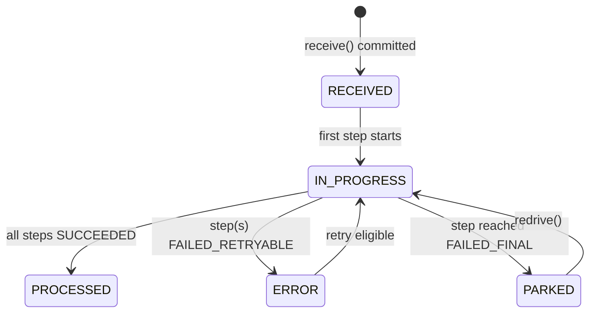
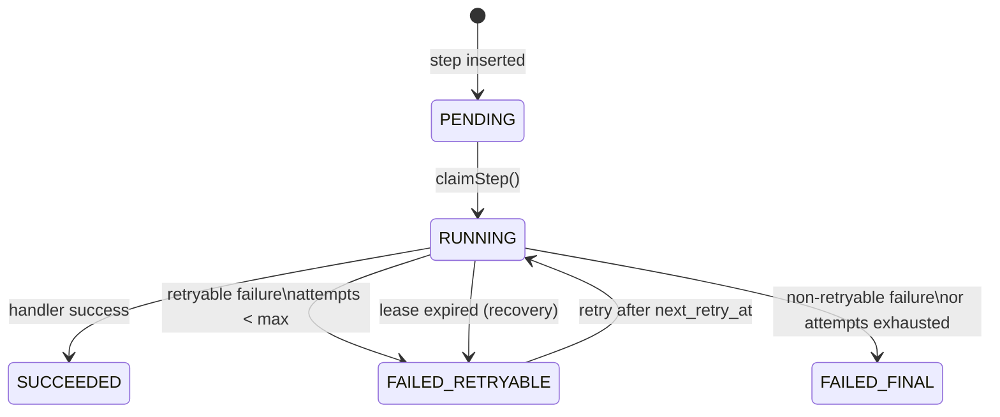
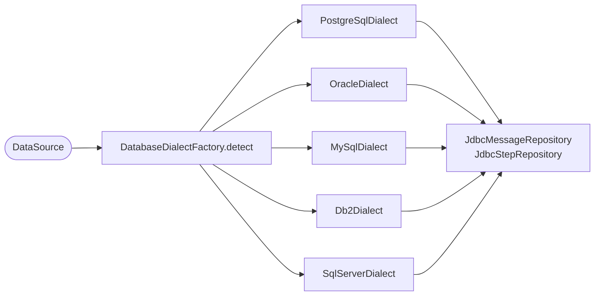

# Configuration Reference

---

## Config Options

```java
DurableFlowConfig config = DurableFlowConfig.builder()
    .nodeId("my-node-1")                         // default: random UUID
    .leaseTimeoutSeconds(60)                     // default: 60
    .recoveryIntervalSeconds(30)                 // default: 30
    .immediateExecutionThreads(4)                // default: 4
    .schemaAutoMigrate(true)                     // default: true
    .dialect(PostgreSqlDialect.INSTANCE)         // default: auto-detected
    .executionMode(ExecutionMode.ASYNCHRONOUS)   // default: ASYNCHRONOUS
    .build();
```

| Property | Default | Description |
|---|---|---|
| `nodeId` | random UUID | Identifies this node in the `owner` column |
| `leaseTimeoutSeconds` | 60 | How long a step lease is held before recovery |
| `recoveryIntervalSeconds` | 30 | How often the recovery scheduler runs |
| `immediateExecutionThreads` | 4 | Thread pool size for post-receive step execution |
| `schemaAutoMigrate` | true | Whether to run Flyway migrations on startup |
| `dialect` | auto-detected | Override the `DatabaseDialect`; `null` = auto-detect |
| `executionMode` | `ASYNCHRONOUS` | `SYNCHRONOUS` blocks `receive()` until steps complete; `ASYNCHRONOUS` returns immediately |

---

## Persistence & Schema

The schema is managed by **Flyway** and applied automatically on engine startup (configurable).

### Key tables

| Table | Purpose |
|---|---|
| `messages` | One row per unique message |
| `message_steps` | One row per step per message |
| `message_step_dependencies` | DAG edges between steps |

> **Performance at scale:** The default schema works well up to tens of millions of rows.
> For high-volume deployments, time-based range partitioning (monthly or daily) limits
> scan size and makes old-data archival as simple as dropping a partition.
> See the [Table Partitioning Guide](table-partitioning.md) for ready-to-use DDL
> for every supported database.

### Message States



### Step States



---

## Lease-Based Step Claiming

Step claiming uses an atomic `UPDATE … WHERE …` to prevent double-execution:

```sql
UPDATE message_steps
SET step_state    = 'RUNNING',
    owner         = ?,          -- nodeId
    locked_until  = ?,          -- NOW() + leaseTimeoutSeconds
    attempt_count = attempt_count + 1,
    updated_at    = CURRENT_TIMESTAMP
WHERE id = ?
  AND step_state IN ('PENDING', 'FAILED_RETRYABLE')
  AND (next_retry_at IS NULL OR next_retry_at <= CURRENT_TIMESTAMP)
  AND (locked_until IS NULL OR locked_until < CURRENT_TIMESTAMP)
```

If `executeUpdate()` returns 0, another node claimed the step first — the current node skips it.

---

## Background Recovery

The `RecoveryScheduler` runs every `recoveryIntervalSeconds` (default 30s) and:

1. Resets RUNNING steps with expired leases back to `FAILED_RETRYABLE`
2. Scans for eligible steps and dispatches them to the executor

```sql
-- Recover expired leases
UPDATE message_steps
SET step_state    = 'FAILED_RETRYABLE',
    locked_until  = NULL,
    owner         = NULL,
    next_retry_at = CURRENT_TIMESTAMP,
    updated_at    = CURRENT_TIMESTAMP
WHERE step_state = 'RUNNING'
  AND locked_until < CURRENT_TIMESTAMP
```

---

## Multi-Database Support

The engine auto-detects the database from JDBC metadata on startup and configures the appropriate `DatabaseDialect` automatically. No manual configuration is required.



To override auto-detection, supply a dialect explicitly:

```java
DurableFlowConfig config = DurableFlowConfig.builder()
    .dialect(OracleDialect.INSTANCE)   // override auto-detection
    .build();
```

### Per-Database Notes

| Database | Min Version | Idempotent Insert | Skip-Locked Syntax | Pagination |
|---|---|---|---|---|
| **PostgreSQL** | 9.5 | `ON CONFLICT DO NOTHING` | `FOR UPDATE SKIP LOCKED` | `LIMIT n` |
| **Oracle** | 12c R2 | Plain INSERT + catch ORA-00001 | `FOR UPDATE SKIP LOCKED` | `FETCH FIRST n ROWS ONLY` |
| **MySQL / MariaDB** | MySQL 8.0 / MariaDB 10.6 | `INSERT IGNORE` | `FOR UPDATE SKIP LOCKED` | `LIMIT n` |
| **IBM DB2** | LUW 11.1 | Plain INSERT + catch SQLSTATE 23505 | `FOR UPDATE WITH RR SKIP LOCKED DATA` | `FETCH FIRST n ROWS ONLY` |
| **SQL Server** | 2016 | Plain INSERT + catch error 2627/2601 | `WITH (UPDLOCK, READPAST)` table hints | `TOP(n)` |

### Flyway Schema Locations

Flyway migration scripts are vendor-specific and stored in separate classpaths:

| Database | Flyway Location |
|---|---|
| PostgreSQL | `classpath:db/migration/postgresql` |
| Oracle | `classpath:db/migration/oracle` |
| MySQL / MariaDB | `classpath:db/migration/mysql` |
| IBM DB2 | `classpath:db/migration/db2` |
| SQL Server | `classpath:db/migration/sqlserver` |

Schema differences handled per database:

| Concept | PostgreSQL | Oracle | MySQL | DB2 | SQL Server |
|---|---|---|---|---|---|
| Binary data | `BYTEA` | `BLOB` | `LONGBLOB` | `BLOB(10M)` | `VARBINARY(MAX)` |
| Large text | `TEXT` | `CLOB` | `LONGTEXT` | `CLOB(1M)` | `NVARCHAR(MAX)` |
| Timestamp+TZ | `TIMESTAMPTZ` | `TIMESTAMP WITH TIME ZONE` | `DATETIME(6)` (UTC) | `TIMESTAMP WITH TIME ZONE` | `DATETIME2(6)` (UTC) |
| Boolean | `BOOLEAN` | `NUMBER(1,0)` | `TINYINT(1)` | `SMALLINT` | `BIT` |
| Partial indexes | ✅ | ❌ (regular indexes) | ❌ (regular indexes) | ❌ (regular indexes) | ✅ (filtered indexes) |

> **MySQL/MariaDB note:** Add `serverTimezone=UTC` to the JDBC URL to ensure timestamps are stored as UTC:
> `jdbc:mysql://host/db?serverTimezone=UTC&useUnicode=true&characterEncoding=utf8mb4`

---

## Module Structure

```
durable-flow/
├── pom.xml                          # Root POM (multi-module)
├── durable-flow-core/               # Main library
│   ├── src/main/java/io/github/durableflow/
│   │   ├── api/                     # Public API (records, enums, interfaces)
│   │   ├── spi/                     # Extension points (preprocessor, metrics)
│   │   ├── engine/                  # Workflow orchestration internals
│   │   ├── persistence/             # JDBC repositories
│   │   │   └── dialect/             # DatabaseDialect SPI + 5 implementations
│   │   ├── scheduler/               # Background recovery
│   │   ├── DurableFlowEngine.java   # Main entry point
│   │   └── DurableFlowConfig.java
│   └── src/main/resources/
│       └── db/migration/
│           ├── postgresql/          # PostgreSQL schema
│           ├── oracle/              # Oracle 12c+ schema
│           ├── mysql/               # MySQL 8.0 / MariaDB 10.6+ schema
│           ├── db2/                 # IBM DB2 LUW 11.1+ schema
│           └── sqlserver/           # SQL Server 2016+ schema
└── durable-flow-example/            # Runnable examples
    └── src/main/java/io/github/durableflow/example/
```

---

## Technology Stack

| Technology | Version | Purpose |
|---|---|---|
| Java | 17 | Language |
| Maven | 3.9+ | Build |
| SLF4J | 2.0 | Logging facade |
| HikariCP | 5.1 | JDBC connection pool |
| zero-allocation-hashing | 0.16 | XXH3 128-bit hashing |
| Flyway | 10.x | Schema migrations (all 5 dialects) |
| Jackson | 2.17 | JSON metadata serialization |
| JUnit 5 | 5.10 | Unit testing |
| Testcontainers | 1.19 | Integration testing with PostgreSQL |
| Mockito | 5 | Mocking |
| PostgreSQL | 9.5+ | Primary persistence backend |
| Oracle | 12c R2+ | Supported via OracleDialect |
| MySQL / MariaDB | 8.0 / 10.6+ | Supported via MySqlDialect |
| IBM DB2 | LUW 11.1+ | Supported via Db2Dialect |
| SQL Server | 2016+ | Supported via SqlServerDialect |
