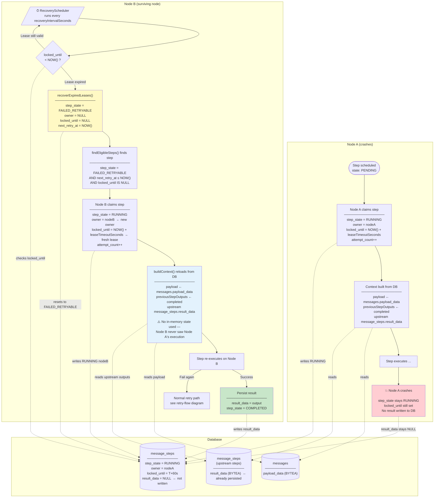

# Node Failure Recovery Flow

This diagram shows what happens when a node crashes while executing a step, and how a surviving node detects and recovers the work — including how step context is stored and restored.



## How context survives a node crash

| What | Where stored | When written | When read |
|------|-------------|--------------|-----------|
| Original message payload | `messages.payload_data` (BYTEA) | When the workflow is first received | Before every step execution |
| Output of each upstream step | `message_steps.result_data` (BYTEA) | When that step completes successfully | Before every downstream step execution |
| In-progress step result | never written | — | — |

The crashed step (on Node A) never wrote its `result_data` because it never completed. Node B's `buildContext()` simply does not include it — only the outputs of the steps that succeeded before the crash are loaded. The reconstructed `StepContext` is identical to what Node A would have seen at the start of its execution.

## Recovery timing

The worst-case recovery window is:

```
max wait ≈ leaseTimeoutSeconds + recoveryIntervalSeconds
         ≈ 60 s             + 30 s  (defaults)
         = 90 s
```

The step cannot be double-dispatched: the `UPDATE … WHERE locked_until IS NULL` claim is atomic, so only one node can claim the step even if multiple schedulers run concurrently.

See the [FAQ](faq.md) for configuration options that control the recovery window.
