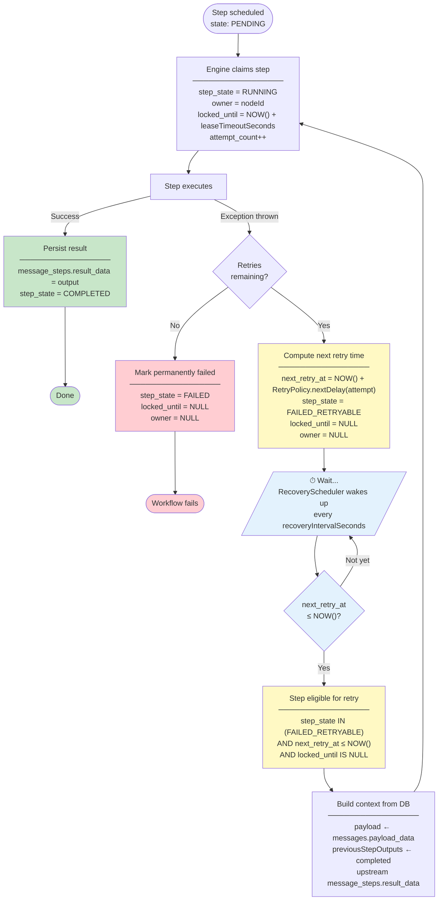

# Step Retry Flow

This diagram shows the full lifecycle of a step that fails and is retried under normal (non-crash) conditions.

## Key points

- The **effective retry delay** is `max(RetryPolicy.nextDelay, recoveryIntervalSeconds)`. If the policy delay is shorter than the scheduler interval, the step waits for the next scheduler tick.
- Each retry **re-claims** the step with a fresh lease (`locked_until`, `owner`), so the step cannot be double-dispatched.
- Step context (payload and upstream outputs) is **always reconstructed from the database** — no in-memory state is involved, making retries safe even after a JVM restart.
- `next_retry_at` and `locked_until` are reset to `NULL` when transitioning to `FAILED_RETRYABLE`, allowing any healthy node's scheduler to pick up the step.

See the [FAQ](faq.md) for configuration options that control retry behaviour.
